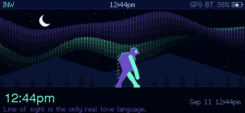
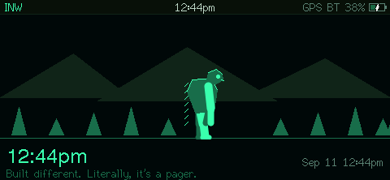
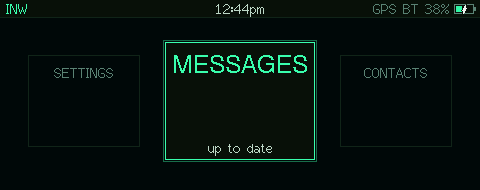
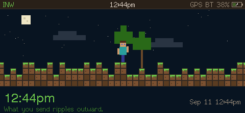
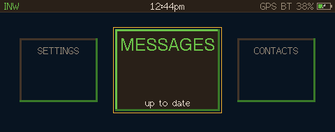
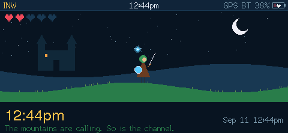
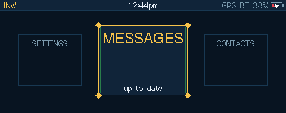
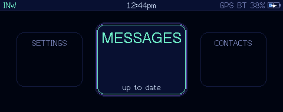

# INW Mesh

Standalone MeshCore firmware for the LilyGo T-Lora Pager, built for the Inland
Northwest mesh but usable on any MeshCore network.

The pager runs a full MeshCore companion node, so it works on its own (keyboard,
wheel, screen) and still pairs with the MeshCore phone app over Bluetooth like
stock firmware.

**Website and browser installer:** https://inwmesh.lovable.app
(or the plain installer at https://bambam1121.github.io/inw-mesh/)



## Themes

Each theme changes the colours, the lock-screen scene, the card style, the
sounds, the vibration, the charging indicator and the plug-in chime.
(Screenshots straight off the pager.)

| | Lock screen | Home |
|---|---|---|
| **INW** |  |  |
| **Blocks** |  |  |
| **Hero** |  |  |
| **Aurora** |  |  |

## Features

- **Messages:** channels, DMs and room servers. Delivery ticks, retries, how many
  repeaters were heard passing a post on, @mentions, quick replies and colour emoji.
  A red NEW line marks where unread messages start.
- **Per-chat notifications:** any channel, contact or room can follow the global
  settings or be set to all, @mentions only, silent or muted.
- **Contacts:** up to 1000, searchable, sortable by recency, name or distance.
  Repeater and room admin with login, status, telemetry, trace and a console.
- **Map:** offline tiles from the SD card, with every contact that shares a
  position. Missing tiles download while you're on Wi-Fi.
- **Tools:** discover nearby repeaters, recently heard nodes, radio stats, a
  packet sniffer, GPS status, screenshots to SD.
- **Wi-Fi:** saved networks, internet time, map tiles.
- **Wi-Fi updates:** the pager checks for a new release on start (or from
  Settings > System) and asks before installing. Releases are signed; the pager
  verifies the signature and the download before switching, and keeps the old
  version if anything goes wrong. Contacts, keys and settings are untouched.
- **NFC:** read and write tags, share your contact or a channel invite by tapping
  a phone to the pager.
- **Themes:** INW, Blocks, Hero and Aurora (see above).
- **Lock screen:** a rotating one-liner under the clock, a few hundred of them:
  jokes, mesh tips, per-theme lines and live ones from your own contact list.
- **Battery:** an accurate percentage from the fuel gauge (the charger is set up so
  the gauge sees every full charge), optimised charging that holds at 80% until
  shortly before you usually unplug, and a battery saver that turns off GPS,
  Bluetooth and Wi-Fi at 20%.
- **Reliability:** contact and channel saves are crash-safe and fast, backups
  run daily to flash and SD with a progress screen, and a torn store is restored
  on boot.
- **Settings:** radio presets, client repeat, auto-add rules, notifications with
  quiet hours, vibration strength, Bluetooth PIN, backups.

## Keys

| | |
|---|---|
| wheel turn / press | move / select |
| Backspace | back (or delete while typing) |
| Enter | send, or select |
| orange key (hold) | numbers and symbols |
| on the home screen | `m` messages, `c` contacts, `p` map, `t` tools, `s` settings, `n` NFC, `l` lock |
| in a chat | press the wheel for emoji and quick replies |
| on the map | wheel zooms, `wasd` pans, `n` next node, `c` centre on me |

## Install

Use the [web installer](https://inwmesh.lovable.app) in Chrome or Edge.
It never writes the bootloader and never erases the flash.

- **Update** writes only the app. Settings, contacts and messages stay.
- **First install** also writes the partition table. The first boot then
  formats the data store, which takes a few minutes. If the SD card holds a
  MeshCore export (`meshcore-backup.json`) or a Wadamesh data folder, contacts and
  channels are imported from it.
- **Coming from 1.0.x?** Wi-Fi updates need the newer two-slot layout, so do one
  First install. Back up to SD first (Settings > System > how to enable wi-fi
  updates does it for you): everything comes back from the card. Without a card
  your keys, channels and settings are still kept; contacts refill from adverts.
- After that, updates arrive over Wi-Fi.

## Building

[PlatformIO](https://platformio.org/):

```bash
pio run -e t-lora-pager           # full firmware, what the releases are built from
pio run -e t-lora-pager-public    # without NFC
```

Flash the app only:

```bash
esptool.py --chip esp32s3 write_flash 0x10000 .pio/build/t-lora-pager/firmware.bin
```

Don't use `erase_flash` and don't write address 0x0. The pager needs the
bootloader it already has.

To pre-load a node identity at first boot, create `src/identity_seed.h` with
`SEED_PRV64_HEX`, `SEED_PUB_HEX` and `SEED_NAME`. The file is gitignored. Don't
commit a private key.

### NFC and ST's licence

The NFC chip is driven by ST's RFAL library (via LilyGo's ST25R3916-NFC-RFAL),
which is under ST's own licence, SLA0052, included in `licenses/`. The rest of the
firmware is GPL-3.0. If you'd rather have a build with no ST code in it, use the
`t-lora-pager-public` environment.

## Layout

| | |
|---|---|
| `src/node.*` | MeshCore companion node (MyMesh) with hooks for the UI |
| `src/history.*` | on-device message history |
| `src/dataio.*` | restore, backup, export |
| `src/ui.*` | view stack, menus, prompts, text and emoji rendering |
| `src/home.cpp`, `chats.cpp`, `contacts.cpp`, `mapview.cpp`, `tools.cpp`, `settings_ui.cpp`, `nfcapp.cpp` | the screens |
| `src/netwifi.*` | Wi-Fi, NTP, tile downloads |
| `variants/inw_pager/` | board definition for MeshCore |
| `docs/hardware.md` | pinout and hardware notes |

## Licence

GPL-3.0. See [THIRD_PARTY.md](THIRD_PARTY.md) for the code and assets this builds on.
