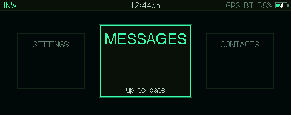
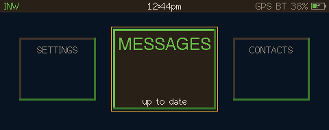
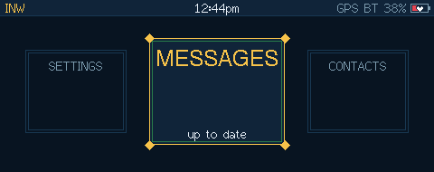
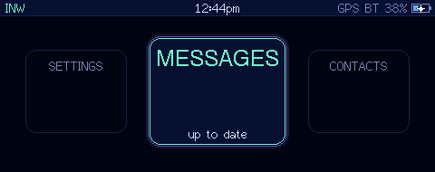

# Squatch Mesh

Free, open-source MeshCore firmware for the LilyGo T-Lora Pager and the T-Deck.
Made in the Inland Northwest, usable on any MeshCore network.

The pager runs a full MeshCore companion node: it works on its own (keyboard, wheel,
screen) and still pairs with the MeshCore phone app over Bluetooth like stock
firmware.

**Website:** https://squatchmesh.com &middot;
**Install from your browser:** https://squatchmesh.com/install &middot;
**T-Deck:** https://squatchmesh.com/t-deck &middot;
**Help:** https://squatchmesh.com/help


## Themes

Each theme changes the colours, the lock-screen scene and its character, the screen
changes, the card style, the sounds, the vibration and the charging splash.
(Lock screens are the firmware's own drawing; home screens are screenshots.)

You can also make your own: [squatchmesh.com/theme-maker](https://squatchmesh.com/theme-maker)
lets you pick the colours and a name, shows the real screens as you go, and sends the
theme to the device over USB. It shows up in Settings with the built-in ones (up to
four of your own), and never leaves your computer and device.

| | Lock screen | Home |
|---|---|---|
| **Squatch** |  |  |
| **Blocks** |  |  |
| **Hero** |  |  |
| **Aurora** |  |  |
| **Halloween** |  |  |

In Halloween the sasquatch wears a different costume every time the screen comes on
(zombie, witch, vampire, ghost, pumpkin head, skeleton, mummy) and walks somewhere
different: a street, a graveyard, a pumpkin patch or the woods. It has its own screen
changes too: slime, bats, creaking doors, a jack-o'-lantern and lightning.

## Features

- **Messages:** channels, DMs and room servers. Delivery ticks, retries, how many
  repeaters were heard passing a post on, @mentions, quick replies and colour emoji.
  A red NEW line marks where unread messages start. Message details name the
  repeaters a message came through, and hop counts show the repeater id size (4h 2B).
- **Per-chat notifications:** any channel, contact or room can follow the global
  settings or be set to all, @mentions only, silent or muted.
- **Region scopes,** as in the MeshCore app: a region per channel or a default for
  everything, and "discover regions" asks the repeaters in range what they carry.
- **Contacts:** up to 2000, searchable, sortable by recency, name or distance.
  Repeater and room admin with login, status, telemetry, trace and a console.
- **Map:** offline tiles from the SD card, with every contact that shares a
  position. Missing tiles download while you're on Wi-Fi.
- **Tools:** discover nearby repeaters, recently heard nodes, radio stats, a
  packet sniffer, GPS status, screenshots to SD, and field tools: a range test, an
  SOS beacon (with a 20 s countdown to cancel) and a breadcrumb trail.
- **The talking sasquatch:** the lock screen's character has a speech bubble. He
  reacts to a real shake (and hops), says hello for the time of day when you pick
  the pager up, and speaks up for a new message, the charger and a low battery. 165
  lines, no repeats until he's said them all. The 1.2.4 beta redraws him with fur, a
  face, blinking and a mouth that moves as he talks, waving, yawning and more.
- **Motion sensor:** raise to wake, quiet when face down, and a man-down alarm; the
  lock scene leans as you tip the pager. The 1.2.4 beta adds *stay on while held*:
  held up to be read, the screen doesn't time out.
- **Updates install by themselves:** on Wi-Fi it checks every six hours and puts a
  new official release in when the pager is idle. Betas always ask. Releases are
  signed; the pager verifies the signature and the download before switching, and
  keeps the old version if anything goes wrong. Contacts, keys and settings are
  untouched.
- **Problem reports:** after a crash or an error the pager sends the developer a
  short report over Wi-Fi with the pager's mesh name on it, and checks in once a day
  with just its board and version. Never messages, contacts, keys or your position. Settings > System turns both off;
  the [privacy page](https://squatchmesh.com/privacy) has the details.
- **First start:** radio region presets, a named time zone with daylight saving,
  12/24 h and miles/km.
- **Wi-Fi:** saved networks, says why it won't join, internet time, map tiles, and it
  backs off when none of your networks is around.
- **Top header:** plug-in I2C sensors (BME280, BMP280, SHT3x, SHT4x, AHT20, BH1750)
  shown under Tools and sent as telemetry, and IO9 as a message LED or buzzer.
- **NFC:** read and write tags, share your contact or a channel invite by tapping
  a phone to the pager.
- **Lock screen:** the time once, the date, and a rotating one-liner under the
  clock, a few hundred of them: jokes, mesh tips, per-theme lines and live ones from
  your own contact list.
- **Battery:** an accurate percentage from the fuel gauge, optimised charging that
  holds at 80% until shortly before you usually unplug, and a battery saver that
  turns off GPS, Bluetooth, Wi-Fi and the motion sensor at 20%.
- **Reliability:** contact and channel saves are crash-safe and fast, backups
  run daily to flash and SD with a progress screen, and a torn store is restored
  on boot.
- **Settings:** radio presets, client repeat, auto-add rules, notifications with
  quiet hours, vibration strength, Bluetooth PIN, backups.

## T-Deck

The same firmware for the LilyGo T-Deck and T-Deck Plus, made for the touchscreen:
a dashboard home, swipe up to unlock, notifications you can tap to open, and a
sasquatch you can poke. Install it from https://squatchmesh.com/t-deck; its updates
come over Wi-Fi while it charges. The source is on the
[`tdeck`](https://github.com/BamBam1121/inw-mesh/tree/tdeck) branch, with the
board's own drivers in `src/tdeck/`.

## Keys (pager)

| | |
|---|---|
| wheel turn / press | move / select |
| Backspace | back (or delete while typing) |
| Enter | send, or select |
| orange key (hold) | numbers and symbols |
| side button | tap: screen off and lock; hold: power off prompt; five fast taps: SOS |
| on the home screen | `m` messages, `c` contacts, `p` map, `t` tools, `s` settings, `n` NFC, `l` lock |
| in a chat | press the wheel for emoji and quick replies |
| on the map | wheel zooms, `wasd` pans, `n` next node, `c` centre on me |

## Install

Use the [web installer](https://squatchmesh.com/install) in Chrome or Edge.
Both options write the bootloader, partition table and app, so either one can
bring back a pager that won't start. Neither erases the flash; don't tick
"erase device", which wipes contacts and channels too.

- **Update** keeps settings, contacts and messages.
- **First install** is for a pager coming from other firmware. The first boot then
  formats the data store, which takes a few minutes. If the SD card holds a
  MeshCore export (`meshcore-backup.json`) or a Wadamesh data folder, contacts and
  channels are imported from it.
- **Coming from 1.0.x?** Wi-Fi updates need the newer two-slot layout, so do one
  First install. Back up to SD first (Settings > System > how to enable wi-fi
  updates does it for you): everything comes back from the card. Without a card
  your keys, channels and settings are still kept; contacts refill from adverts.
- **Starting over?** From 1.2.5 the installer has two tick boxes under START.
  *Start fresh* clears contacts, channels and messages and keeps your keys, name
  and Wi-Fi. *Reset everything* clears the keys and settings too, and the pager
  comes up as new. Exports and dated backups on the SD card are left alone.
- After that, updates install themselves over Wi-Fi (Settings > System > install
  updates by itself turns that off, and then it asks first).
- **Installer can't connect?** On the pager, Settings > System > usb flash mode,
  then click install. (On 1.1.5 or older: hold BOOT, tap RESET, let go of BOOT.)
- **Pager won't start?** Hold BOOT, tap RESET, let go of BOOT, and run First
  install again. It works even on a completely blank chip.
- **Stuck?** Ask on [Discussions](https://github.com/BamBam1121/inw-mesh/discussions)
  or see https://squatchmesh.com/help.

## Building

[PlatformIO](https://platformio.org/):

```bash
pio run -e t-lora-pager           # full firmware, what the releases are built from
pio run -e t-lora-pager-public    # without NFC
pio run -e t-lora-pager-dev       # a developer build with USB test commands (never released)
```

Flash the app only:

```bash
esptool.py --chip esp32s3 write_flash 0x10000 .pio/build/t-lora-pager/firmware.bin
```

Don't use `erase_flash` and don't write address 0x0. The pager needs the
bootloader it already has.

To pre-load a node identity at first boot, create `src/identity_seed.h` with
`SEED_PRV64_HEX`, `SEED_PUB_HEX` and `SEED_NAME`. The file is gitignored. Don't
commit a private key.

### NFC and ST's licence

The NFC chip is driven by ST's RFAL library (via LilyGo's ST25R3916-NFC-RFAL),
which is under ST's own licence, SLA0052, included in `licenses/`. The rest of the
firmware is GPL-3.0. If you'd rather have a build with no ST code in it, use the
`t-lora-pager-public` environment.

## Layout

| | |
|---|---|
| `src/node.*` | MeshCore companion node (MyMesh) with hooks for the UI |
| `src/history.*` | on-device message history |
| `src/dataio.*` | restore, backup, export |
| `src/ui.*` | view stack, menus, prompts, text and emoji rendering |
| `src/home.cpp`, `chats.cpp`, `contacts.cpp`, `mapview.cpp`, `tools.cpp`, `settings_ui.cpp`, `nfcapp.cpp` | the screens |
| `src/scenes.h`, `mascot.h`, `squatch_talk.h`, `fx*.cpp` | the lock scenes, the sasquatch and what he says, the screen changes |
| `src/regions.*`, `regional.*` | region scopes; region presets and time zones |
| `src/motion.*` | the motion sensor: raise to wake, stay on while held, man-down |
| `src/netwifi.*`, `ota.*`, `bugreport.*` | Wi-Fi, NTP and tile downloads; updates; problem reports |
| `variants/inw_pager/` | board definition for MeshCore |
| `web/`, `helpdesk/` | squatchmesh.com and its help desk |
| `docs/hardware.md` | pinout and hardware notes |

## Licence

GPL-3.0. See [THIRD_PARTY.md](THIRD_PARTY.md) for the code and assets this builds on.
